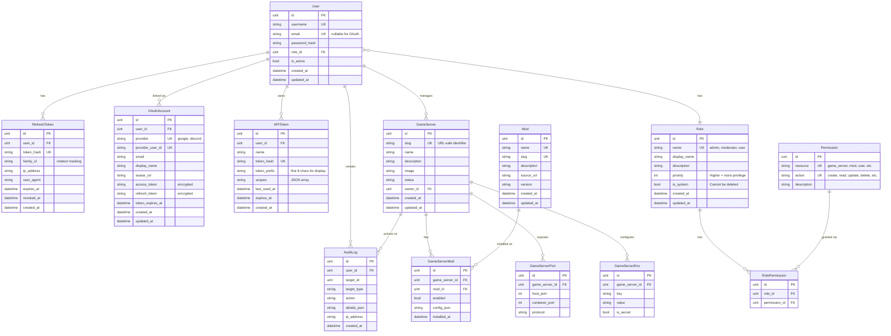
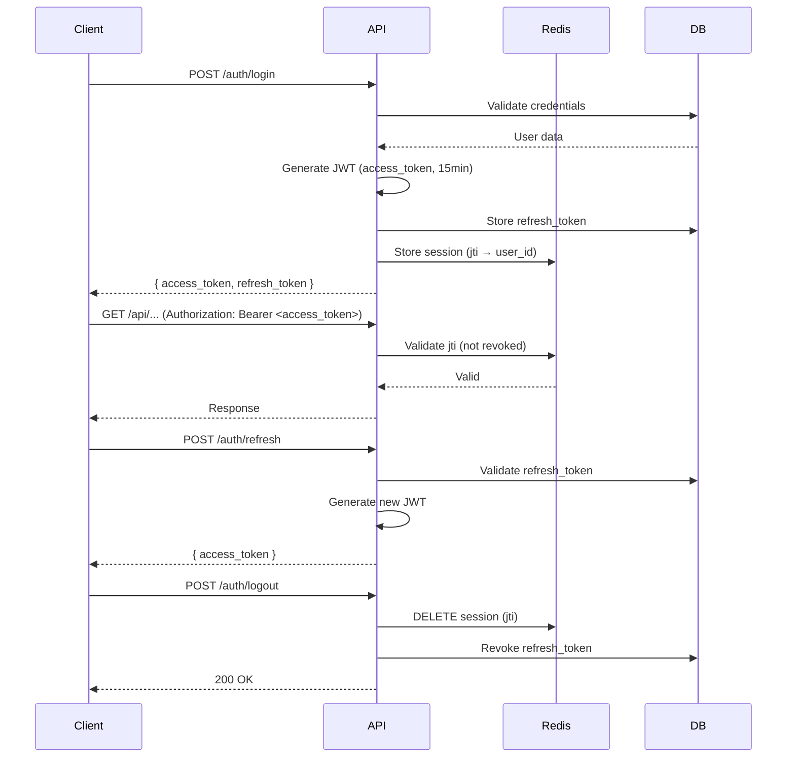

# Sabakan Database Design

ゲームサーバーコンテナ、MOD、ユーザーを統合管理するためのデータベース設計。

## 技術スタック

- **DBMS**: SQLite (GORM)
- **ORM**: [GORM](https://gorm.io/)
- **マイグレーション**: GORM AutoMigrate

---

## ER図



---

## テーブル詳細

### `users` - ユーザー

| Column          | Type     | Constraints              | Description                          |
| --------------- | -------- | ------------------------ | ------------------------------------ |
| `id`            | INTEGER  | PK, AUTO                 | ユーザーID                           |
| `username`      | TEXT     | UNIQUE, NOT NULL         | ユーザー名                           |
| `email`         | TEXT     | UNIQUE                   | メールアドレス (OAuth時はNULL可)     |
| `password_hash` | TEXT     |                          | bcryptハッシュ (OAuth時はNULL)       |
| `role_id`       | INTEGER  | FK → roles, NOT NULL     | ロールID                             |
| `is_active`     | BOOLEAN  | DEFAULT TRUE             | アカウント有効フラグ                 |
| `created_at`    | DATETIME |                          | 作成日時                             |
| `updated_at`    | DATETIME |                          | 更新日時                             |

**インデックス:**

- `idx_users_role` (`role_id`)

---

### `oauth_accounts` - OAuth連携アカウント

| Column             | Type     | Constraints                           | Description                        |
| ------------------ | -------- | ------------------------------------- | ---------------------------------- |
| `id`               | INTEGER  | PK, AUTO                              | ID                                 |
| `user_id`          | INTEGER  | FK → users, NOT NULL                  | ユーザーID                         |
| `provider`         | TEXT     | NOT NULL                              | プロバイダー (`google`, `discord`) |
| `provider_user_id` | TEXT     | NOT NULL                              | プロバイダー側のユーザーID         |
| `email`            | TEXT     |                                       | OAuth取得メールアドレス            |
| `display_name`     | TEXT     |                                       | OAuth取得表示名                    |
| `avatar_url`       | TEXT     |                                       | アバターURL                        |
| `access_token`     | TEXT     |                                       | アクセストークン (暗号化)          |
| `refresh_token`    | TEXT     |                                       | リフレッシュトークン (暗号化)      |
| `token_expires_at` | DATETIME |                                       | トークン有効期限                   |
| `created_at`       | DATETIME |                                       | 作成日時                           |
| `updated_at`       | DATETIME |                                       | 更新日時                           |

**制約:**

- UNIQUE (`provider`, `provider_user_id`)

**インデックス:**

- `idx_oauth_accounts_user` (`user_id`)

---

### `api_tokens` - APIトークン

| Column         | Type     | Constraints          | Description                          |
| -------------- | -------- | -------------------- | ------------------------------------ |
| `id`           | INTEGER  | PK, AUTO             | ID                                   |
| `user_id`      | INTEGER  | FK → users, NOT NULL | ユーザーID                           |
| `name`         | TEXT     | NOT NULL             | トークン名 (識別用)                  |
| `token_hash`   | TEXT     | UNIQUE, NOT NULL     | トークンハッシュ                     |
| `token_prefix` | TEXT     | NOT NULL             | 表示用プレフィックス (先頭8文字)     |
| `scopes`       | TEXT     |                      | 許可スコープ (JSON配列)              |
| `last_used_at` | DATETIME |                      | 最終使用日時                         |
| `expires_at`   | DATETIME |                      | 有効期限 (NULLは無期限)              |
| `created_at`   | DATETIME |                      | 作成日時                             |

**インデックス:**

- `idx_api_tokens_user` (`user_id`)

---

### `roles` - ロール

| Column         | Type     | Constraints      | Description                         |
| -------------- | -------- | ---------------- | ----------------------------------- |
| `id`           | INTEGER  | PK, AUTO         | ロールID                            |
| `name`         | TEXT     | UNIQUE, NOT NULL | システム名 (`admin`, `user`, etc.)  |
| `display_name` | TEXT     | NOT NULL         | 表示名                              |
| `description`  | TEXT     |                  | 説明                                |
| `priority`     | INTEGER  | DEFAULT 0        | 優先度 (高いほど上位権限)           |
| `is_system`    | BOOLEAN  | DEFAULT FALSE    | システムロール (削除不可)           |
| `created_at`   | DATETIME |                  | 作成日時                            |
| `updated_at`   | DATETIME |                  | 更新日時                            |

**デフォルトロール (シード):**

| name      | display_name | priority | is_system |
| --------- | ------------ | -------- | --------- |
| admin     | 管理者       | 100      | true      |
| moderator | モデレーター | 50       | true      |
| user      | ユーザー     | 10       | true      |
| guest     | ゲスト       | 0        | true      |

---

### `permissions` - 権限

| Column        | Type    | Constraints      | Description                                   |
| ------------- | ------- | ---------------- | --------------------------------------------- |
| `id`          | INTEGER | PK, AUTO         | 権限ID                                        |
| `resource`    | TEXT    | NOT NULL         | リソース名 (`game_server`, `mod`, `user`)     |
| `action`      | TEXT    | NOT NULL         | アクション (`create`, `read`, `update`, etc.) |
| `description` | TEXT    |                  | 説明                                          |

**制約:**

- UNIQUE (`resource`, `action`)

**権限一覧 (シード):**

| resource    | action | description           |
| ----------- | ------ | --------------------- |
| game_server | create | サーバー作成          |
| game_server | read   | サーバー閲覧          |
| game_server | update | サーバー編集          |
| game_server | delete | サーバー削除          |
| game_server | start  | サーバー起動          |
| game_server | stop   | サーバー停止          |
| mod         | create | MOD追加               |
| mod         | read   | MOD閲覧               |
| mod         | update | MOD編集               |
| mod         | delete | MOD削除               |
| user        | create | ユーザー作成          |
| user        | read   | ユーザー閲覧          |
| user        | update | ユーザー編集          |
| user        | delete | ユーザー削除          |
| role        | manage | ロール管理            |
| audit_log   | read   | 監査ログ閲覧          |
| system      | admin  | システム管理 (全権限) |

---

### `role_permissions` - ロール権限関連

| Column          | Type    | Constraints      | Description |
| --------------- | ------- | ---------------- | ----------- |
| `id`            | INTEGER | PK, AUTO         | ID          |
| `role_id`       | INTEGER | FK → roles       | ロールID    |
| `permission_id` | INTEGER | FK → permissions | 権限ID      |

**制約:**

- UNIQUE (`role_id`, `permission_id`)

**デフォルト権限割り当て:**

| role      | permissions                           |
| --------- | ------------------------------------- |
| admin     | `system:admin` (全権限)               |
| moderator | `game_server:*`, `mod:*`, `user:read` |
| user      | `game_server:read`, `mod:read`        |
| guest     | (なし)                                |

---

### セッション管理 (JWT + Redis)

**認証アーキテクチャ:**



**Redis キー設計:**

| Key Pattern | Value | TTL | Description |
| --- | --- | --- | --- |
| `session:{jti}` | `{user_id, ip, ua}` | 15min | アクティブセッション |
| `user:{user_id}:sessions` | Set of jti | - | ユーザーの全セッション (一括ログアウト用) |
| `revoked:{jti}` | `1` | 24h | 無効化されたJTI (ブラックリスト) |

---

### `refresh_tokens` - リフレッシュトークン

| Column       | Type     | Constraints      | Description                     |
| ------------ | -------- | ---------------- | ------------------------------- |
| `id`         | INTEGER  | PK, AUTO         | ID                              |
| `user_id`    | INTEGER  | FK → users       | ユーザーID                      |
| `token_hash` | TEXT     | UNIQUE, NOT NULL | トークンハッシュ (SHA256)       |
| `family_id`  | TEXT     | NOT NULL, INDEX  | トークンファミリー (回転追跡用) |
| `ip_address` | TEXT     |                  | 発行時IP                        |
| `user_agent` | TEXT     |                  | ブラウザ情報                    |
| `expires_at` | DATETIME | NOT NULL         | 有効期限 (7日)                  |
| `revoked_at` | DATETIME |                  | 無効化日時                      |
| `created_at` | DATETIME |                  | 作成日時                        |

**インデックス:**

- `idx_refresh_tokens_user` (`user_id`)
- `idx_refresh_tokens_family` (`family_id`)

**セキュリティ考慮:**

- **Token Rotation**: リフレッシュ時に新しいトークンを発行し、古いトークンを無効化
- **Family Tracking**: 同じファミリーのトークンが2回使用された場合、全ファミリーを無効化（盗難検知）
- **Redis Blacklist**: アクセストークンの即時無効化用


### `game_servers` - ゲームサーバー

| Column | Type | Constraints | Description |
|--------|------|-------------|-------------|
| `id` | INTEGER | PK, AUTO | サーバーID |
| `slug` | TEXT | UNIQUE, NOT NULL | URL用識別子 (例: `minecraft-survival-1`) |
| `name` | TEXT | NOT NULL | 表示名 |
| `description` | TEXT | | 説明文 |
| `image` | TEXT | NOT NULL | コンテナイメージ |
| `status` | TEXT | DEFAULT 'stopped' | `running`, `stopped`, `creating`, `error` |
| `container_id` | TEXT | | Podmanコンテナ ID (実行時) |
| `owner_id` | INTEGER | FK → users | 所有者 |
| `created_at` | DATETIME | | 作成日時 |
| `updated_at` | DATETIME | | 更新日時 |

---

### `game_server_ports` - ポートマッピング

| Column | Type | Constraints | Description |
|--------|------|-------------|-------------|
| `id` | INTEGER | PK, AUTO | ID |
| `game_server_id` | INTEGER | FK → game_servers | サーバーID |
| `host_port` | INTEGER | NOT NULL | ホスト側ポート |
| `container_port` | INTEGER | NOT NULL | コンテナ側ポート |
| `protocol` | TEXT | DEFAULT 'tcp' | `tcp`, `udp` |

---

### `game_server_envs` - 環境変数

| Column | Type | Constraints | Description |
|--------|------|-------------|-------------|
| `id` | INTEGER | PK, AUTO | ID |
| `game_server_id` | INTEGER | FK → game_servers | サーバーID |
| `key` | TEXT | NOT NULL | 環境変数名 |
| `value` | TEXT | | 値 |
| `is_secret` | BOOLEAN | DEFAULT FALSE | 秘匿フラグ (UIで非表示) |

---

### `mods` - MODカタログ

| Column | Type | Constraints | Description |
|--------|------|-------------|-------------|
| `id` | INTEGER | PK, AUTO | MOD ID |
| `name` | TEXT | UNIQUE, NOT NULL | MOD名 |
| `slug` | TEXT | UNIQUE, NOT NULL | URL用識別子 |
| `description` | TEXT | | 説明 |
| `source_url` | TEXT | | ダウンロードURL / GitHub |
| `version` | TEXT | | バージョン |
| `created_at` | DATETIME | | 作成日時 |
| `updated_at` | DATETIME | | 更新日時 |

---

### `game_server_mods` - サーバーMOD関連

| Column | Type | Constraints | Description |
|--------|------|-------------|-------------|
| `id` | INTEGER | PK, AUTO | ID |
| `game_server_id` | INTEGER | FK → game_servers | サーバーID |
| `mod_id` | INTEGER | FK → mods | MOD ID |
| `enabled` | BOOLEAN | DEFAULT TRUE | 有効/無効 |
| `config_json` | TEXT | | MOD固有設定 (JSON) |
| `installed_at` | DATETIME | | インストール日時 |

**制約:**
- UNIQUE (`game_server_id`, `mod_id`)

---

### `audit_logs` - 監査ログ

| Column | Type | Constraints | Description |
|--------|------|-------------|-------------|
| `id` | INTEGER | PK, AUTO | ログID |
| `user_id` | INTEGER | FK → users, NULL | 操作者 (システムはNULL) |
| `target_type` | TEXT | NOT NULL | `game_server`, `mod`, `user` |
| `target_id` | INTEGER | | 対象のID |
| `action` | TEXT | NOT NULL | `create`, `update`, `delete`, `start`, `stop` |
| `details_json` | TEXT | | 詳細情報 (JSON) |
| `ip_address` | TEXT | | 操作元IP |
| `created_at` | DATETIME | | 操作日時 |

**インデックス:**
- `idx_audit_logs_target` (`target_type`, `target_id`)
- `idx_audit_logs_user` (`user_id`)

---

## GORM モデル例

```go
// Role represents a user role with permissions.
type Role struct {
    gorm.Model
    Name        string `gorm:"uniqueIndex;not null"`
    DisplayName string `gorm:"not null"`
    Description string
    Priority    int  `gorm:"default:0"`
    IsSystem    bool `gorm:"default:false"`
    Permissions []Permission `gorm:"many2many:role_permissions;"`
    Users       []User
}

// Permission represents an action that can be performed on a resource.
type Permission struct {
    gorm.Model
    Resource    string `gorm:"not null;uniqueIndex:idx_resource_action"`
    Action      string `gorm:"not null;uniqueIndex:idx_resource_action"`
    Description string
    Roles       []Role `gorm:"many2many:role_permissions;"`
}

// User represents a system user.
type User struct {
    gorm.Model
    Username      string `gorm:"uniqueIndex;not null"`
    Email         *string `gorm:"uniqueIndex"` // Nullable for OAuth users
    PasswordHash  string
    RoleID        uint   `gorm:"not null;index"`
    Role          Role
    IsActive      bool   `gorm:"default:true"`
    OAuthAccounts []OAuthAccount
    APITokens     []APIToken
    GameServers   []GameServer
    RefreshTokens []RefreshToken
}

// OAuthAccount represents a linked OAuth provider account.
type OAuthAccount struct {
    gorm.Model
    UserID         uint   `gorm:"not null;index"`
    User           User
    Provider       string `gorm:"not null;uniqueIndex:idx_oauth_provider_user"`
    ProviderUserID string `gorm:"not null;uniqueIndex:idx_oauth_provider_user"`
    Email          string
    DisplayName    string
    AvatarURL      string
    AccessToken    string // Encrypted
    RefreshToken   string // Encrypted
    TokenExpiresAt *time.Time
}

// APIToken represents an API access token.
type APIToken struct {
    gorm.Model
    UserID      uint   `gorm:"not null;index"`
    User        User
    Name        string `gorm:"not null"`
    TokenHash   string `gorm:"uniqueIndex;not null"`
    TokenPrefix string `gorm:"not null"` // First 8 chars for display
    Scopes      string // JSON array of allowed scopes
    LastUsedAt  *time.Time
    ExpiresAt   *time.Time
}


// RefreshToken represents a long-lived refresh token for JWT rotation.
type RefreshToken struct {
    gorm.Model
    UserID    uint   `gorm:"not null;index"`
    User      User
    TokenHash string `gorm:"uniqueIndex;not null"`
    FamilyID  string `gorm:"not null;index"` // For rotation tracking
    IPAddress string
    UserAgent string
    ExpiresAt time.Time  `gorm:"not null"`
    RevokedAt *time.Time // Null if not revoked
}


// GameServer represents a managed game server container.
type GameServer struct {
    gorm.Model
    Slug        string `gorm:"uniqueIndex;not null"`
    Name        string `gorm:"not null"`
    Description string
    Image       string `gorm:"not null"`
    Status      string `gorm:"default:stopped"`
    ContainerID string
    OwnerID     uint `gorm:"index"`
    Owner       User
    Ports       []GameServerPort
    Envs        []GameServerEnv
    Mods        []GameServerMod
}

// AuditLog records user actions for auditing purposes.
type AuditLog struct {
    ID          uint `gorm:"primaryKey"`
    CreatedAt   time.Time
    UserID      *uint `gorm:"index"` // Nullable for system actions
    User        *User
    TargetType  string `gorm:"not null;index:idx_audit_target"`
    TargetID    uint   `gorm:"index:idx_audit_target"`
    Action      string `gorm:"not null"`
    DetailsJSON string
    IPAddress   string
}
```

---

## マイグレーション戦略

1. **開発環境**: GORM `AutoMigrate` を使用
2. **本番環境**: [golang-migrate](https://github.com/golang-migrate/migrate) または [Atlas](https://atlasgo.io/) を検討

```go
// Init時に自動マイグレーション
db.AutoMigrate(
    &Role{},
    &Permission{},
    &User{},
    &OAuthAccount{},
    &APIToken{},
    &RefreshToken{},
    &GameServer{},
    &GameServerPort{},
    &GameServerEnv{},
    &Mod{},
    &GameServerMod{},
    &AuditLog{},
)


// シードデータ投入
func SeedRolesAndPermissions(db *gorm.DB) error {
    // 1. Create permissions
    permissions := []Permission{
        {Resource: "system", Action: "admin", Description: "Full system access"},
        {Resource: "game_server", Action: "create", Description: "Create servers"},
        {Resource: "game_server", Action: "read", Description: "View servers"},
        {Resource: "game_server", Action: "update", Description: "Edit servers"},
        {Resource: "game_server", Action: "delete", Description: "Delete servers"},
        {Resource: "game_server", Action: "start", Description: "Start servers"},
        {Resource: "game_server", Action: "stop", Description: "Stop servers"},
        {Resource: "mod", Action: "create", Description: "Add mods"},
        {Resource: "mod", Action: "read", Description: "View mods"},
        {Resource: "mod", Action: "update", Description: "Edit mods"},
        {Resource: "mod", Action: "delete", Description: "Delete mods"},
        {Resource: "user", Action: "create", Description: "Create users"},
        {Resource: "user", Action: "read", Description: "View users"},
        {Resource: "user", Action: "update", Description: "Edit users"},
        {Resource: "user", Action: "delete", Description: "Delete users"},
        {Resource: "role", Action: "manage", Description: "Manage roles"},
        {Resource: "audit_log", Action: "read", Description: "View audit logs"},
    }
    for _, p := range permissions {
        db.FirstOrCreate(&p, Permission{Resource: p.Resource, Action: p.Action})
    }

    // 2. Create roles with permissions
    roles := []struct {
        Name        string
        DisplayName string
        Priority    int
        IsSystem    bool
        Perms       []string // "resource:action"
    }{
        {"admin", "Administrator", 100, true, []string{"system:admin"}},
        {"moderator", "Moderator", 50, true, []string{
            "game_server:*", "mod:*", "user:read",
        }},
        {"user", "User", 10, true, []string{"game_server:read", "mod:read"}},
        {"guest", "Guest", 0, true, []string{}},
    }
    // ... role creation logic
    return nil
}
```

---

## 権限チェック実装例

```go
// HasPermission checks if a user has a specific permission.
func (u *User) HasPermission(db *gorm.DB, resource, action string) bool {
    var count int64
    db.Model(&Permission{}).
        Joins("JOIN role_permissions ON permissions.id = role_permissions.permission_id").
        Where("role_permissions.role_id = ?", u.RoleID).
        Where("(permissions.resource = ? AND permissions.action = ?) OR "+
              "(permissions.resource = 'system' AND permissions.action = 'admin')",
            resource, action).
        Count(&count)
    return count > 0
}

// RequirePermission is a middleware for Echo.
func RequirePermission(resource, action string) echo.MiddlewareFunc {
    return func(next echo.HandlerFunc) echo.HandlerFunc {
        return func(c echo.Context) error {
            user := c.Get("user").(*User)
            if !user.HasPermission(db.GetDB(), resource, action) {
                return echo.ErrForbidden
            }
            return next(c)
        }
    }
}
```

---

## 今後の拡張案

| 機能               | 追加テーブル案                                |
| ------------------ | --------------------------------------------- |
| ゲームテンプレート | `game_templates`, `template_envs`             |
| バックアップ管理   | `backups`                                     |
| 通知設定           | `notifications`, `user_notification_settings` |
| プレイヤーデータ   | `players`, `player_stats`                     |


