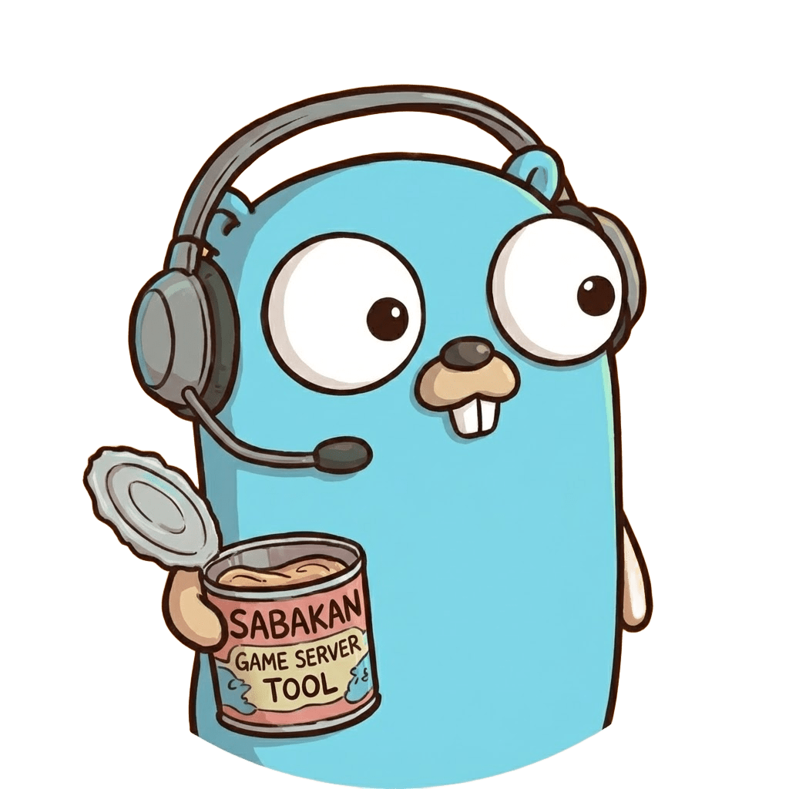

<p align="center">
  
</p>

# Sabakan

**Sabakan** は、ゲームサーバーコンテナ、WebMAP、MODを統合管理するシステムです。

## 機能

- 🎮 **コンテナ管理** - Podman経由でゲームサーバーコンテナを起動・停止・監視
- 📊 **ダッシュボード** - コンテナ状態をリアルタイム表示
- 📝 **ログビューア** - コンテナログをブラウザで確認

## Supported Games

| Game | Docker Image | Status |
|------|--------------|--------|
| 🟫 Minecraft | [itzg/docker-minecraft-server](https://github.com/itzg/docker-minecraft-server) | ✅ Supported |
| 🦎 Palworld | [thijsvanloef/palworld-server-docker](https://github.com/thijsvanloef/palworld-server-docker) | ✅ Supported |
| 🧟 7 Days to Die | [vinanrra/Docker-7DaysToDie](https://github.com/vinanrra/Docker-7DaysToDie) | ✅ Supported |
| 🏭 Satisfactory | [wolveix/satisfactory-server](https://github.com/wolveix/satisfactory-server) | ✅ Supported |
| 🦖 ARK: Survival Evolved | [hermsi/ark-server](https://hub.docker.com/r/hermsi/ark-server/) | ✅ Supported |
| ⚙️ Factorio | [factoriotools/factorio](https://hub.docker.com/r/factoriotools/factorio) | ✅ Supported |
| 🔫 Rust | [max-pfeiffer/rust-game-server-docker](https://github.com/max-pfeiffer/rust-game-server-docker) | ✅ Supported |

## Current Status

- ✅ **Container Management** - Start/Stop/List functionality (Backend & Frontend)
- 🏗️ **Authentication** - Backend handlers & models implemented (JWT + Redis); Frontend integration pending
- 🏗️ **RBAC** - Data models defined; Policy enforcement pending
- 🏗️ **Mod Management** - Data models defined; API & UI pending
- 🏗️ **Audit Logging** - Data models defined

## Roadmap

- [x] Basic Container Operations (List, Start, Stop)
- [x] User & Role Database Models
- [x] Authentication API (Login, Register, Refresh)
- [ ] Frontend Authentication UI (Login Page, Guards)
- [ ] Role Based Access Control (RBAC) Middleware
- [ ] Mod Management System
- [ ] World Map Integration (WebMAP)
- [ ] Discord/Webhook Integration


## Tech Stack

| Layer | Technology |
|---|---|
| Frontend | Angular 21 + Angular Material + Bun |
| Backend | Go 1.25 + Echo Framework |
| Container | Podman (Docker互換) |
| Database | SQLite (GORM) |

## Quick Start

### Podman Compose (推奨)

```bash
# 開発コンテナを起動
podman compose up

# アクセス
# - Frontend: http://localhost:4200
# - Backend API: http://localhost:1323
```

### ローカル開発

```bash
# Backend
cd backend
cp config.example.toml config.toml
go run ./cmd/sabakan

# Frontend (別ターミナル)
cd frontend
bun install
bun run start
```

## Container API

| Endpoint | Method | Description |
|---|---|---|
| `/api/containers` | GET | コンテナ一覧 |
| `/api/containers/:id` | GET | コンテナ詳細 |
| `/api/containers/:id/start` | POST | コンテナ起動 |
| `/api/containers/:id/stop` | POST | コンテナ停止 |
| `/api/containers/:id/logs` | GET | コンテナログ |

## Project Structure

```text
sabakan/
├── backend/           # Go + Echo API
│   ├── cmd/sabakan/   # エントリポイント
│   ├── internal/      # 内部パッケージ
│   │   ├── config/    # 設定管理
│   │   ├── container/ # コンテナサービス
│   │   ├── handlers/  # REST APIハンドラ
│   │   ├── models/    # データモデル
│   │   └── server/    # Echoサーバー
│   └── config.example.toml
├── frontend/          # Angular + Material
│   └── src/app/
│       ├── features/containers/  # コンテナ管理UI
│       ├── models/               # TypeScript型定義
│       └── services/             # APIサービス
├── Containerfile      # 本番用 (Alpine)
├── Containerfile.dev  # 開発用 (Debian + Podman)
└── compose.yml        # Podman Compose設定
```

## Documentation

- [GEMINI.md](./GEMINI.md) - 開発ガイドライン
- [Storybook](https://sweetfish329.github.io/sabakan/) - コンポーネントカタログ

## License

MIT
